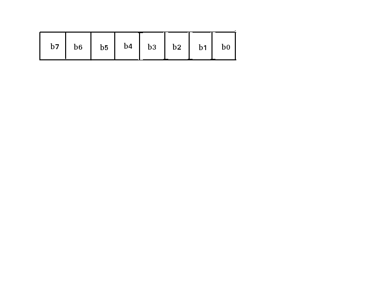

<h2> SEF </h2>

a symmetry encryption algorithm based on fountain code.

<h2> Feature </h2>

+ PKCS7 padding and depadding
+ symmetry
+ support 8, 16, 32, 64, 128, 256 bits key

<h2> Algorithm Design </h2> 

this algorithm just use the bitwise **xor** to encrypt the message, but it cycle the key, and use a mask to 
cover the key, so it's really difficute to guess the start encrypt data block without know the key.

the complexity grows along with the key bits:

+ 8 bit key will encrypt a block data of 64 bits 8 turns chained way
+ 16 bit key will encrypt a block data of 64 bits 16 turns chained way
+ 32 bit, 32 turns
+ 64 bit, 64 turns
+ 128 bit, 128 turns
+ 256 bit, 256 turns

for a block data of 64 bits, the encrypt process start with the source block data on the first turn, but the second turn will base on the preview result. so if one want to decrypt the source data, he or  she need to inverse the process with [8, 16, 32, 64, 128, 256] turns with the exact key [256, 65526, 4294967296, ...]. the complexity grows very fastly.

<h2> Encryption </h2> 

encrypt process for a block of data with 8 bit key

<h2> Decryption </h2>

decrypt process for a block cliper with 8 bit key

<h2> Tester </h2>

requirements:

+ gnuplot
+ matplotlib

current tester:

+ key bits length tester
+ message length tester
+ common symmetric data encryption

<h2> Author </h2> 

smileboywtu@gmail.com
